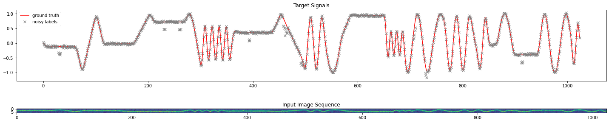
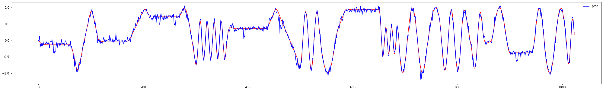
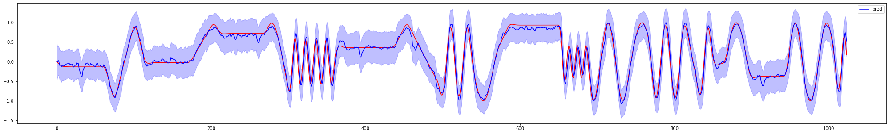
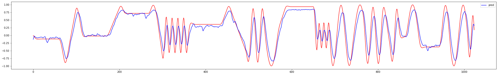

Neural Filters
==============

This repo contains experiments with a blend of classical and neural-network based filtering algorithms.

Task
----

* Regression of coordinates from a sequence of 1d images as toy proxy for more sophisticated state estimation.
* Labels are corrupted by gaussian noise as well as salt-and-pepper noise.
* Input images are generated from the corrupted (!) labels by painting a gaussian with mean corresponding to the coordinate signal into the image.
* The coordinate signal is synthetic, realized by a concatenation of constant, sinusoidal, and triangular waveforms with subsequent smoothing.

Below, a visualization of the data is shown. The red line shows the uncorrupted signal

Questions
---------

* Can "smoothness" penalties yield better predictions?
* Suppress noise and ignore outliers, in particular.
* How do models with a classical structure like Kalman filter perform versus LSTMs?
* Can the models be trained end-to-end?

Not covered:

* How does the smoothness penalty compare to pre-filtering the labels?

These questions have been answered in the literature for various use cases but I wanted to make my own experiments.

The idea with the smoothness penalty can be extended to enforcing arbitrary differential constraints on the predicted signal `f`, i.e. `g(f(x), df/dx(x), df^2/dx^2(x), ...) = 0`. In fact, I made an attempt to limit the acceleration `df^2/dx^2(x)` below a threshold. It is also possible (but not shown here) to penalize the amplitude of selected frequency components because the Fourier transform to obtain the amplitudes is differentiable.

Code
----

* LSTM-Denoise.ipynb: LSTM based filters
* KF-Denoise.ipynb: Kalman filters

The rest is boilerplate and utility.

Examples
--------

Blue line shows prediction. The models are trained with L2 loss on the coordinate prediction.

### Single frame regression

A linar layer attached to a small convolutional backbone directly regresses to the coordinate.

### Kalman filter 

The observation model, based on the same backbone, outputs mean and variance of a normal distribution. The state evolution model is the linear piecewise constant velocity with noisy acceleration model. It's coefficients are fixed.

The posterior variance from the observation model is also shown. But it's overall scale depends on the parameters of the motion model.

### LSTM with smoothness loss

An LSTM on top of the CNN backbone. In addition to the L2 loss, the second derivative of the output is heavily penalized.
]
